# kottans-frontend
Frontend course from Kottans

## 0. Git Basics

The course from Udacity was very useful and interesting for me.

  
Screenshot

  
  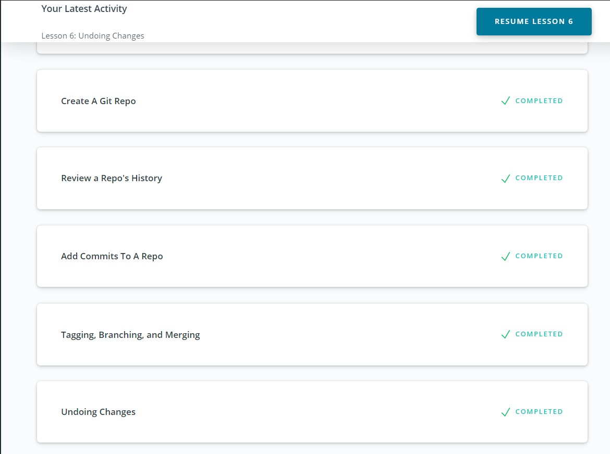
  

## 1. Linux CLI, and HTTP
### 1.1 Linux Survival (4 modules)

First two modules was easy, 'cause I worked on Linux a little before.

    
Screenshot

  
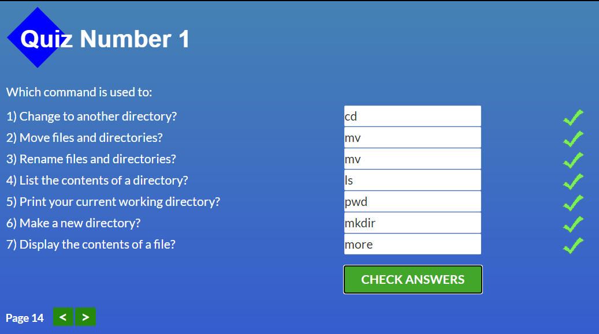

  

  
Screenshot

  
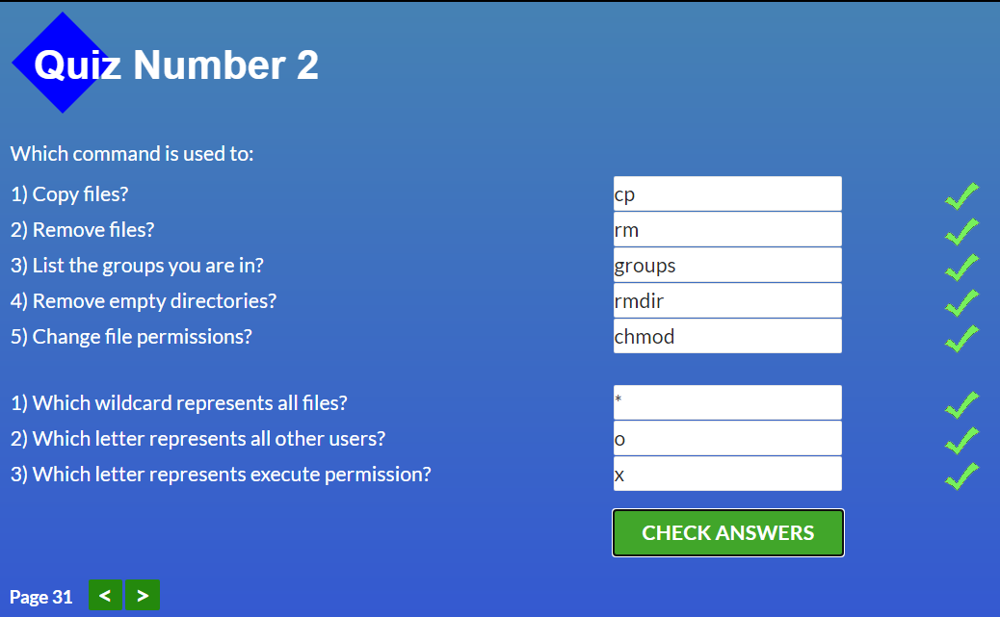

The next two modules was not so easy, actually. 

    
Screenshot

  
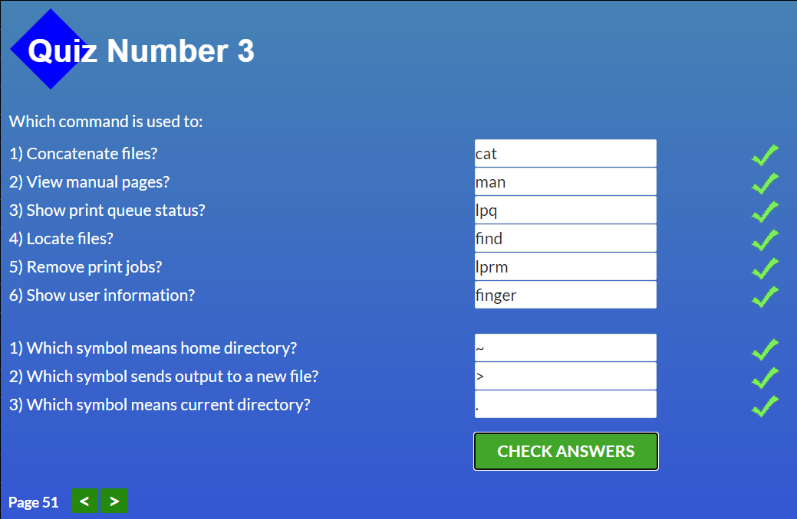

  

  
Screenshot

  
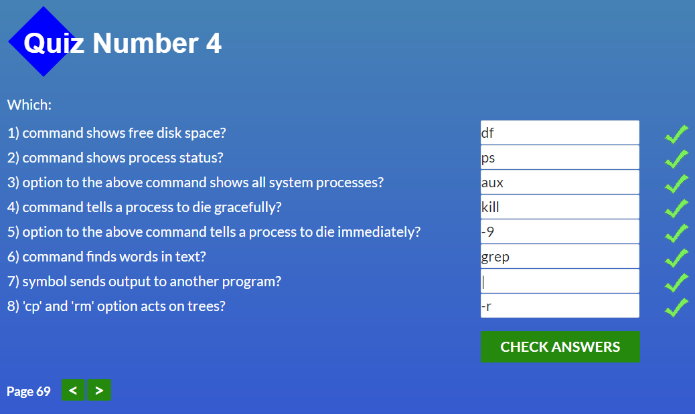

### 1.2 HTTP: The Protocol Every Web Developer Must Know - Part 1

These request verbs of HTTP are:

* __GET:__ fetch an existing resource. The URL contains all the necessary information the server needs to locate and return the resource.
* __POST:__ create a new resource. POST requests usually carry a payload that specifies the data for the new resource.
* __PUT:__ update an existing resource. The payload may contain the updated data for the resource.
* __DELETE:__ delete an existing resource.

Status Codes:

* 1xx: Informational Messages
* 2xx: Successful (The most common code is 200 __OK__)
* 3xx: Redirection
* 4xx: Client Error (Yep, 404 the most common code)
* 5xx: Server Error (The most commonly used error code is 500 __Internal Server Error__)

### 1.3 HTTP: The Protocol Every Web Developer Must Know - Part 2

__HTTP__

HTTP -> TCP -> IP

__HTTPS__ (s - meaning secured)

HTTP -> __SSL (Secure Sockets Layer) or TLS (Transport Layer Security)__ -> TCP -> IP

Summary it was interesting and useful indormation, but I think I will forget about 80% of this after a week.
  

## 2. Git Collaboration

### 2.1 GitHub & Collaboration

    
Screenshot

  
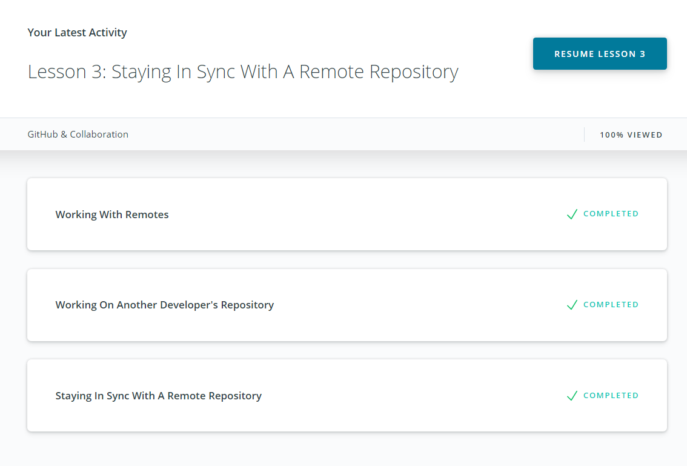

### 2.2 Learn Git Branching

    
Main

  
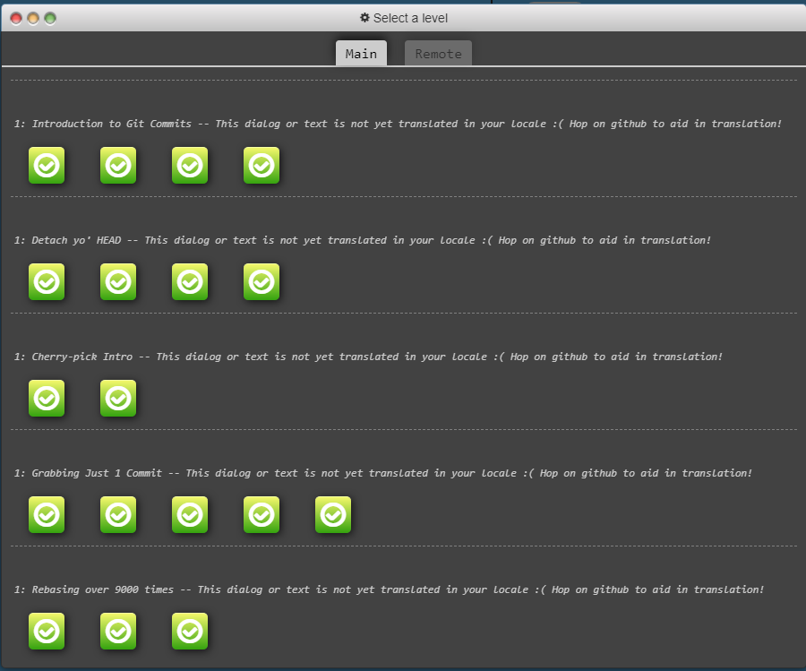

    
Remote

  
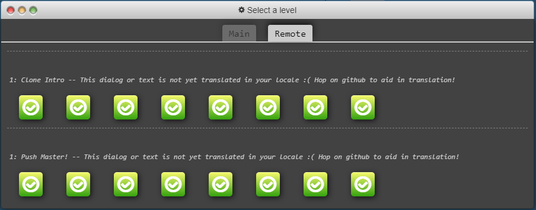

    
Finish

  
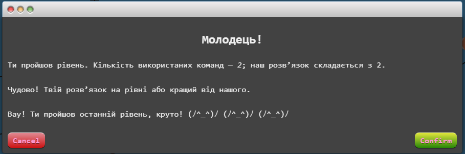

__Useful git commands:__

* __git shortlog__ - show autors and quantity of their commits

 >git shortlog displays an alphabetical list of names and the commit messages that go along with them. If we just want to see just the number of commits that each developer has made, we can add a couple of flags: __-s__ to show just the number of commits (rather than each commit's message) and __-n__ to sort them numerically (rather than alphabetically by author name).

 * __git shortlog -s -n__

* __git log --author="Author Name"__ - filter by author

>How about we filter down to just the commits that reference the word "bug". We can do that with either of the following commands:

 * __git log --grep=bug__  
 or
 * __git log --grep bug__

>origin -> for fork repository  
upstream -> for original repository (from what we make a fork)

* __git push origin master:newBranch__ - take data from master on local repository and add it on origin (ex. GitHub) to newBranch (if it doesn't exist, git makes it)

* __git push origin :foo__ - without first argument before ":" git just delete foo branch

* __git fetch origin :foo__ - git will make  new branch "foo" in local repository

* __git pull origin foo = git fetch origin foo; git merge o/foo__

* __git pull origin bar\~1:bugFix = git fetch origin bar\~1:bugFix; git merge bugFix__

This two courses, especial second one give me a better understanding how to work with git and GitHub. 

## 3. Intro to HTML and CSS

### 3.1 Intro to HTML & CSS (Eng)

    
Screenshot

  
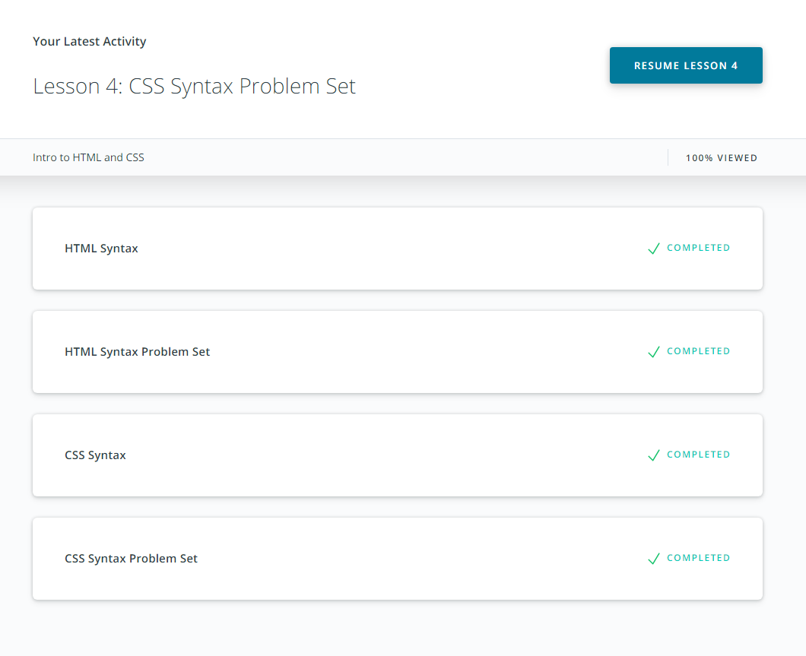

### 3.2 Learn HTML(Eng)

    
Screenshots

  
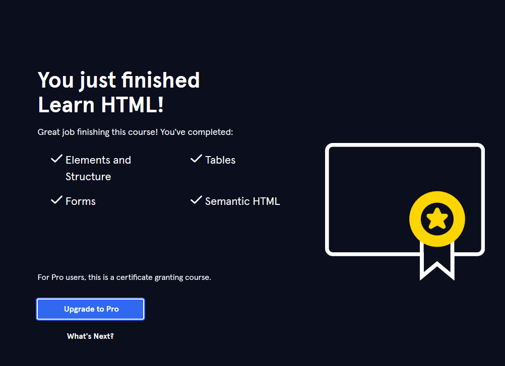

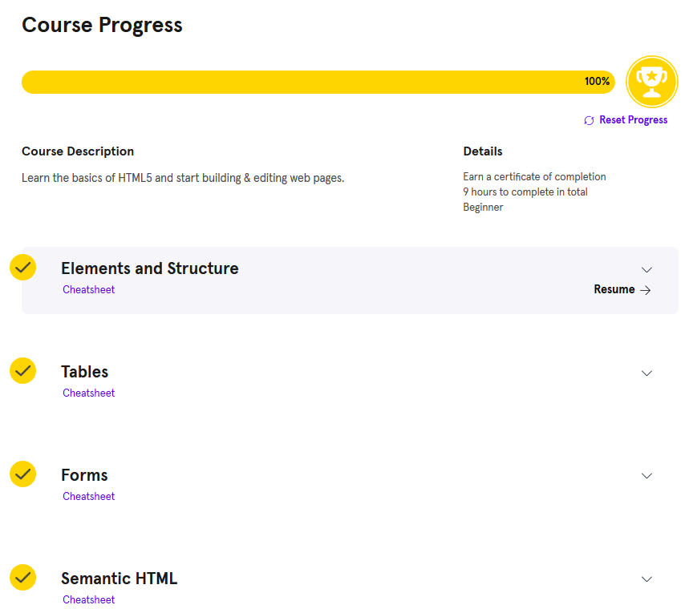

### 3.3 Learn CSS(Eng)

    
Screenshots

  
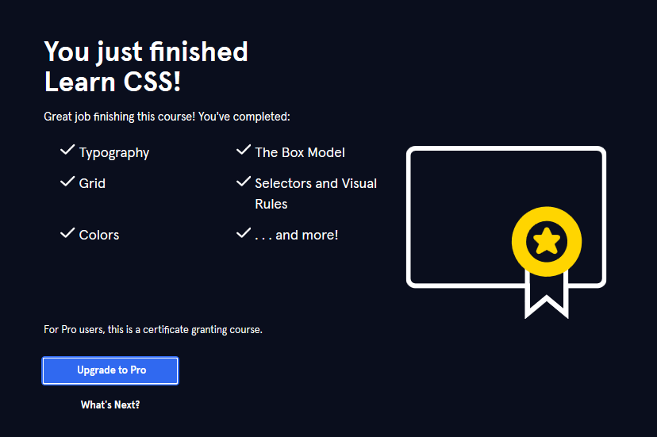

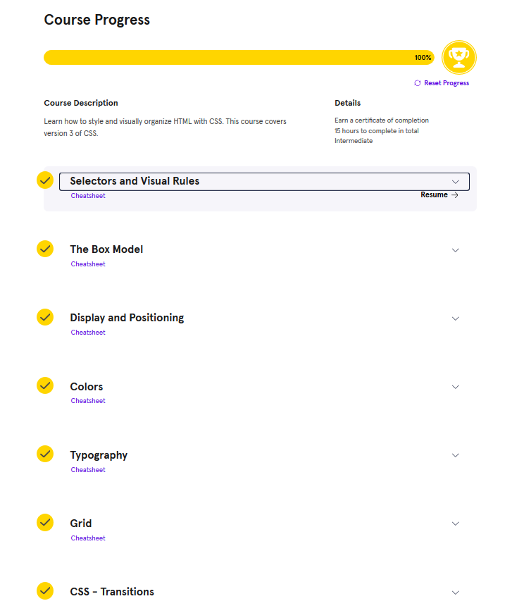

 
Udacity html course was superficial and not consistency. But courses from codeacademy was interesting and more useful. I refreshed knowledge about forms and how to use audio and video tags in HTML and learned a lot about grid in CSS.